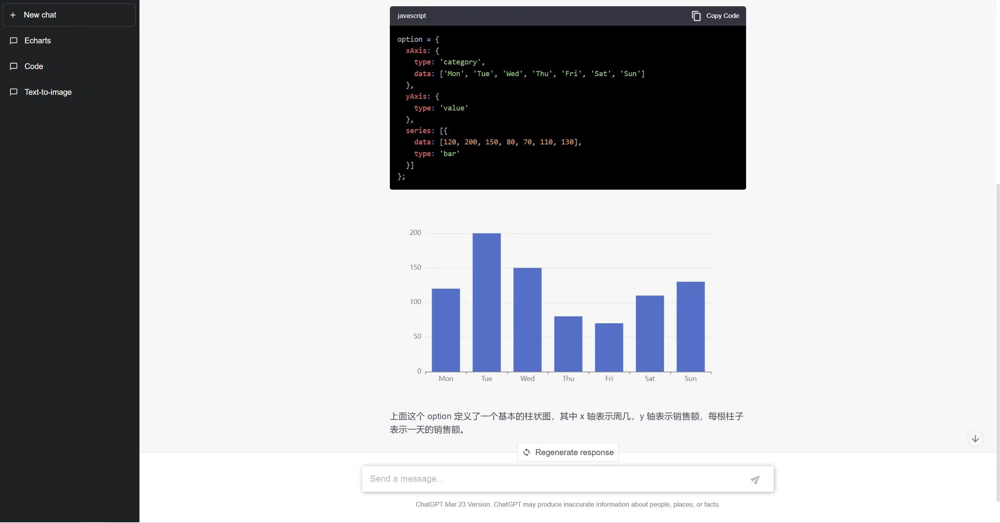

# ChatGPT Demo

This project aims to replicate the design of the conversation interface on the official ChatGPT website. The main features include creating new conversations, displaying responses in a conversational flow, and highlighting code snippets. Additionally, there is a unique feature that **detects code for generating visualizations using ECharts and renders them accordingly**.

## Technologies Used

### Frontend
- **React**
- **Redux**
- **Material-UI (MUI)**
- **ECharts-for-React**
- **React-Syntax-Highlighter**

### Backend
- **Flask**
- **MySQL**

### Additional Details
The frontend implementation involves calling the OpenAI API and handles VPN forwarding using `https-proxy-agent`. The main code for conversation handling is as follows:

```javascript
const api = new ChatGPTAPI({
  ...options,
  fetch: (url, options = {}) => {
    const defaultOptions = {
      agent: new HttpsProxyAgent({host: config.proxyHost, port: config.proxyPort}),server information correctly
    }
    const mergedOptions = {
      ...defaultOptions,
      ...options
    }
    return fetch(url, mergedOptions);
  },
});

await api.sendMessage(sendMsg, {
  systemMessage: '',
  onProgress: r => {
    setOnProgress(true);
    dispatch(uiSlice.actions.changeOnProgress(true));
    setAns(r.text);
    dispatch(uiSlice.actions.changeCurAnswer(r.text));
  },
}).then((res) => {
  setOnProgress(false);
  dispatch(uiSlice.actions.changeOnProgress(false));
  addMessage(curSessionId as string, res.text, false);
});
```

## Screenshots


